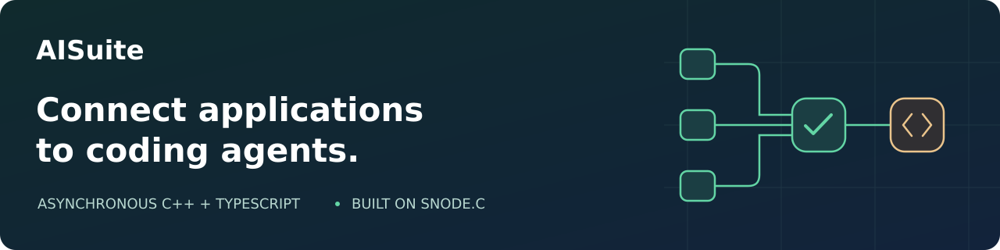
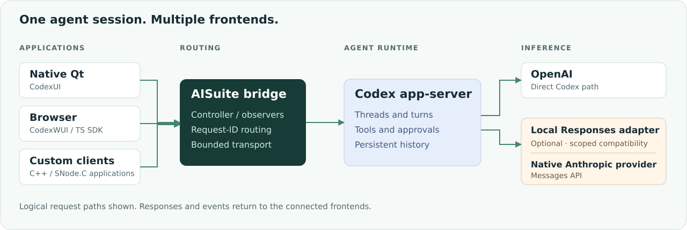

<a name="project-overview"></a>

<p align="center">
  
</p>

<p align="center">
  <a href="https://github.com/SNodeC/AISuite/actions/workflows/ci.yml"></a>
  <a href="LICENSE"></a>
</p>

<p align="center">
  <a href="#what-you-can-build">Use cases</a> ·
  <a href="#architecture">Architecture</a> ·
  <a href="#build-from-source">Build</a> ·
  <a href="#integrate">Integrate</a> ·
  <a href="#documentation">Documentation</a>
</p>

# AISuite

**Agent integration, built for event-driven applications.** AISuite provides asynchronous C++ libraries, a multi-client Codex bridge and a framework-neutral TypeScript frontend SDK, built on [SNode.C](https://github.com/SNodeC/snode.c#project-overview).

Connect native applications, browser frontends and custom clients to a Codex app-server. Keep transport and routing in AISuite; keep conversations, tools, approvals and persistent history with the agent runtime.

**Projects using AISuite:**

- [CodexUI](https://github.com/SNodeC/CodexUI#project-overview)

## What you can build

- **Shared agent workspace:** run `codex-bridge` and connect a controller plus observers to one app-server session.
- **Native integration:** link C++ targets into a SNode.C application and use typed, asynchronous agent or protocol APIs.
- **Browser frontend:** use `@snodec/codex-frontend` over WebSocket without reproducing server-side routing.

For ready-made applications, see **[Codex(W)UI](https://github.com/SNodeC/CodexUI#project-overview)**: **CodexUI** for the native Qt workspace and **CodexWUI** for the browser, both using this bridge.

## Architecture



Three boundaries keep the integration understandable:

1. **Applications own presentation and interaction.** Frontend SDKs correlate requests and deliver events; they do not retain a second conversation store.
2. **AISuite owns transport and routing.** The bridge translates request IDs, dispatches responses to their owners, broadcasts notifications and enforces controller/observer policy. Frames and outgoing queues are bounded.
3. **Codex owns the agent session.** Threads, turns, tools, approvals and persistence remain upstream. A model provider handles inference, not agent lifecycle.

“Stateless bridge” means **no retained Codex-domain state**—not an absence of connection state, pending requests or routing tables.

## Libraries and applications

- `AISuite::OpenAICodex` — Typed backend and frontend SDKs, bridge routing, app-server and client transport adapters.
- `AISuite::Agent` — Common agent selection, conversation/start-turn/interrupt facade and lifecycle contracts.
- `AISuite::Model` — Provider-neutral inference, streaming, usage and cancellation contracts.
- `AISuite::Anthropic` — Native Anthropic Messages API provider; optional at build time.
- `@snodec/codex-frontend` — Framework-neutral TypeScript frontend proxy, connection lifecycle and generated protocol declarations.
- `codex-bridge` — Multi-client bridge application; optional integrated HTTP/WebSocket listener.
- `codex-bridge-client` — Interactive SNode.C frontend client.

### One schema, two typed frontends

C++ views and TypeScript declarations are generated from the same pinned app-server schema and operation bindings. C++ values provide direct field access plus `getRaw()` for lossless access to the original JSON. Raw JSON-RPC submission remains available alongside typed methods.

Generation checks and cross-language equality tests detect drift. Protocol coverage describes the **selected schema**, not a promise that every server version implements every method or that observers may call every read-like API.

### Transports that fit the application

The app-server side supports an owned **stdio JSONL** process or an externally managed app-server over **Unix, IPv4 or IPv6 WebSocket**. Frontend transports include Unix streams, TCP, optional TLS, HTTP/WebSocket and optional RFCOMM, depending on the installed SNode.C components and build options.

All carry the same bridge semantics. Transport selection does not create another agent implementation. See the [transport and lifecycle reference](src/ai/openai/codex/docs/architecture.md).

## Build from source

### Prerequisites

- A C++20 toolchain, CMake 3.18+, and a build tool such as Make.
- Python 3 for the documented app-server integration tests.
- An installed [SNode.C](https://github.com/SNodeC/snode.c#project-overview) `master`/HEAD package satisfying the project's SNode.C 2.0 requirement.
- nlohmann-json headers; optional transports require their corresponding SNode.C components.
- For the default Anthropic-enabled build: OpenSSL and SNode.C HTTP client/server plus IPv4 TLS support.
- A configured Codex executable to run an owned app-server; Node.js 22+ for the frontend SDK development workflow.

### Configure, build and verify

Replace the SNode.C installation prefix:

```sh
cmake -S . -B build \
  -DCMAKE_BUILD_TYPE=Release \
  -DCMAKE_INSTALL_PREFIX=/usr/local \
  -DCMAKE_PREFIX_PATH="/path/to/snodec/prefix" \
  -DAISUITE_BUILD_APPS=ON \
  -DAISUITE_BUILD_CODEX_TESTS=ON
cmake --build build --parallel 14
ctest --test-dir build -L codex --output-on-failure --parallel 14
```

Set `-DAISUITE_ENABLE_ANTHROPIC=OFF` for the direct Codex/OpenAI path without the model-provider HTTP/TLS dependencies. Optional frontend transports are selected from available SNode.C components and can be configured with `AISUITE_ENABLE_CODEX_FRONTEND_TLS`, `AISUITE_ENABLE_CODEX_FRONTEND_WEBSOCKET` and `AISUITE_ENABLE_CODEX_FRONTEND_RFCOMM`.

The example installs into `/usr/local` and needs administrator privileges. To use a writable non-system prefix instead, set `CMAKE_INSTALL_PREFIX` at configure time and omit `sudo`; configure consumers and runtime library lookup for that prefix.

To make the libraries and applications available to consumers:

```sh
sudo cmake --install build
sudo ldconfig
```

## Run the bridge

With Codex available and configured for the account running the bridge:

```sh
codex-bridge
```

The default configuration uses the owned stdio app-server and a local Unix frontend socket. Additional listeners are configured separately.

### Serve a browser frontend

With WebSocket support built, enable a loopback listener:

```sh
codex-bridge codex-bridge-websocket-ipv4 --disabled=false \
  local --host 127.0.0.1 --port 8080
```

The same listener serves a built CodexWUI at `/` and upgrades `/codex` with the `codex` WebSocket subprotocol. Install the web artifact using [CodexWUI's browser instructions](https://github.com/SNodeC/CodexUI/blob/master/web/README.md). The default static root is the configured install data directory's `codexui/web`; the `codex` configuration subcommand's `--bridge-web-root PATH` option overrides it. An empty root disables static delivery without disabling WebSocket. **No Node process is needed to serve the installed application.**

> **Deployment boundary:** controller/observer roles are routing permissions, not user authentication or tenant isolation. Observer reads can include workspace files. Keep listeners private unless you provide an appropriate authenticated access boundary. Review the [observer policy](docs/codex-observer-policy.md) before sharing a session.

## Integrate

### C++ / SNode.C

```cmake
find_package(AISuite CONFIG REQUIRED)
target_link_libraries(my_app PRIVATE AISuite::OpenAICodex)
```

Public Codex headers live under `aisuite/ai/openai/codex`; the namespace is `ai::openai::codex`. Use the frontend proxy for the full Codex protocol or `frontend::CodexAgent` for the common conversation/start-turn/interrupt facade. The underlying Codex APIs remain accessible through `backend()`.

Start with the [interactive client implementation](src/apps/codex-bridge-client) and [SDK architecture reference](src/ai/openai/codex/docs/architecture.md).

### TypeScript / browser

Using the locally built frontend SDK:

```ts
import {
  ClientConnection,
  CodexBridgeClient,
  WebSocketTransport,
} from "@snodec/codex-frontend";

const client = new CodexBridgeClient();
const connection = new ClientConnection(client);
const transport = new WebSocketTransport(connection, "ws://localhost:8080/codex");

client.onServerNotification("thread/started", notification => {
  console.log(notification.params?.thread);
});
```

The transport negotiates the bridge subprotocol. The application owns connection lifetime and reconnect intent. See the [SDK guide](packages/codex-frontend/README.md) for request APIs and lifecycle details; the package is consumed from source by CodexWUI, so this is not an instruction to install a published npm release.

## Agent runtime ≠ model provider

**Codex is currently the implemented agent runtime.** AISuite also supplies a native Anthropic model provider. A scoped local Responses adapter lets an owned Codex app-server use that provider without changing the frontend protocol. The normal OpenAI route remains direct.

```sh
# Supply ANTHROPIC_API_KEY through your environment/secret-management workflow.
# Set CLAUDE_MODEL to an available model and ISOLATED_CODEX_HOME to a dedicated directory.
codex-bridge codex --agent codex --model-provider anthropic \
  --model "$CLAUDE_MODEL" --codex-home "$ISOLATED_CODEX_HOME"
```

This is a **documented text-and-coding-tools compatibility profile**, not a general-purpose Responses implementation or a Claude Code runtime. The Codex compatibility path disables thinking and does not support images/audio, hosted search or every Responses feature. Native provider capabilities and compatibility limits are documented separately in the [provider guide](docs/agent-providers.md) and [Codex compatibility profile](docs/codex-responses-profile.md).

## Verification

The test suites cover routing, framing, callback lifetime, provider behavior and frontend transports. GCC/Clang builds enable warning checks; an optional `AISUITE_ENABLE_ASAN` build enables AddressSanitizer.

For the generated frontend contract:

```sh
npm ci --prefix packages/codex-frontend
npm test --prefix packages/codex-frontend
tools/regenerate-codex-protocol.sh --check
```

Regeneration requires fetching the pinned upstream source. Live provider checks are separately opt-in and may incur API charges; missing prerequisites must not be mistaken for passing coverage. See the [provider verification record](docs/anthropic-verification.md).

## Documentation

| Topic | Reference |
| --- | --- |
| Bridge, SDKs, configuration and transport matrix | [Architecture](src/ai/openai/codex/docs/architecture.md) |
| Agent and model-provider separation | [Providers](docs/agent-providers.md) |
| Anthropic through Codex: supported semantics | [Compatibility profile](docs/codex-responses-profile.md) |
| Controller/observer boundaries | [Read-operation policy](docs/codex-observer-policy.md) |
| Browser/Node frontend integration | [TypeScript SDK](packages/codex-frontend/README.md) |
| Native and browser consumers | [Codex(W)UI](https://github.com/SNodeC/CodexUI#project-overview) — CodexUI and CodexWUI |

When reporting a problem, include AISuite, SNode.C and Codex revisions, the transport, and a minimal reproduction. Remove credentials and private payloads from logs.

## License

Choose either [MIT](LICENSE-MIT) or [LGPL-3.0-or-later](LICENSE-LGPL-3.0-or-later). AISuite is an independent SNode.C-based project, not an official OpenAI or Anthropic SDK.
